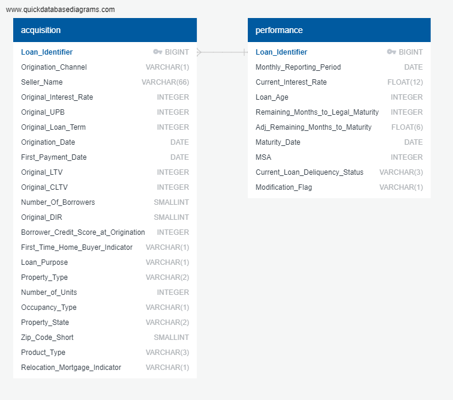
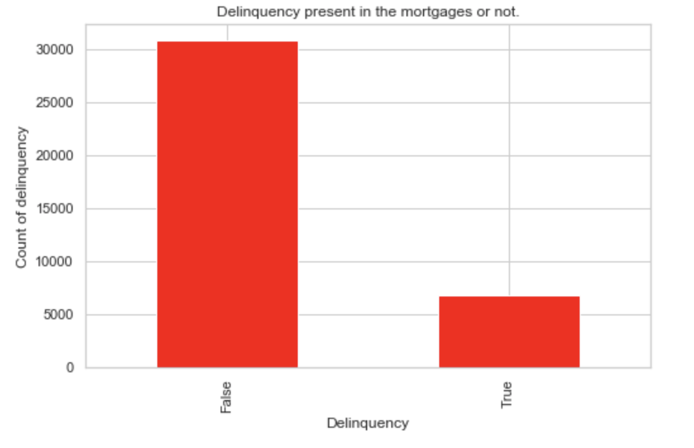
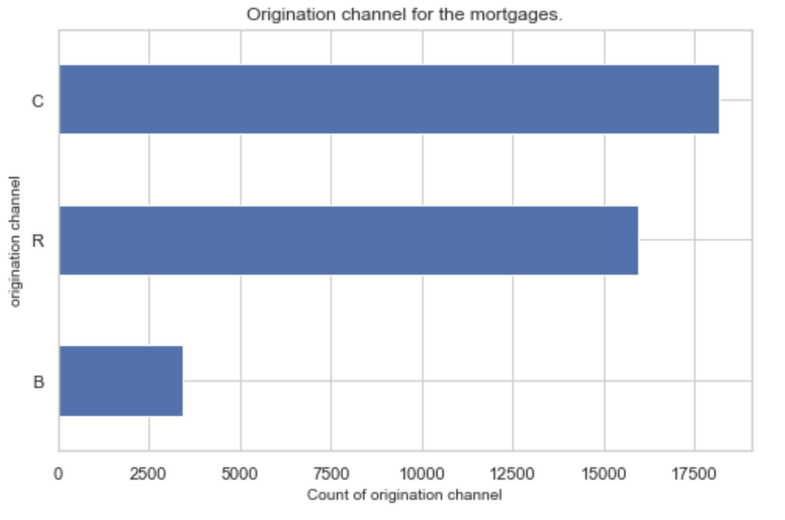
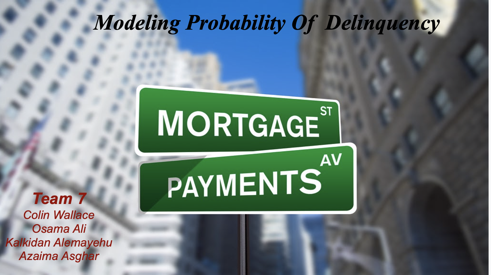

# *Modeling Probablity Of Default*

## *Group Name: Team 7*

## *First Segment*

## *Group Members*

Azaima Azghar: Square Role; Repository Manager.

Colin Wallace: Triangle role; Machine Learning Architect.

Kalkidan Alemayehu: Circle role; Database Manager.

Osama Ali: X role; Technology Manager.

## *Selected topic*

Modeling probability of  mortgage application
default.

## *Reason To Select This Topic*

There is a risk in housing market where the applicant of a mortgage application could default on their mortgage payments or the whole loan altogether. Team 7 is going to look into past data of USA mortgage market to see if a common lifestyle or pattern exists to those files which ended up being put in default or bankcrupt status.

 ## *Description Of The Source Of Data*

Fannie Mae provides loan performance data on a portion of its single-family mortgage loans to promote better understanding of the credit performance of Fannie Mae mortgage loans.

Link: https://www.fanniemae.com/portal/funding-the-market/data/loan-performance-data.html

## *Questions The Data hopes To Answer*

How often do mortgages go into default status?

Is income to loan ratio a major factor to determine risk factor?

Are some states better in maintaining and finishing their term than others?

## *Resources*

* Data Source: Mortgage Data From Fannie Mae.

    * Acquisition and Performance Data.

* pgAdmin/postgressSQL.
* Google Colabs/Jupyter Notebook.
* Amazon Web Services (AWS).
* Github.
* Visual Studio Code.
* Microsoft Excel.

PLAN: The acquisition data and the performance data are merged on common feature 'LOAN IDENTIFIER'.We want to get more satasets for mortgage and merge them as well down the road to include macro variables such as employment and unemployment.

## *What Will Be Used For Each Section?*

*Postgress*: Database Management, Organizing tables, removing columns which dont provide value.

*Google Co-Labs/ Jupyter Notebook*: Data cleaning and Machine Learning algorith execution will be set up using Python, pandas and Scikit Learn libraries.

*Amazon Web Services (AWS)*: Database, CSV and other data file storage.

*Github*: Creating and maintaining Git repository for submission and project colaboration.

*Visual Studio Code*: Updating the readme files in the branches. 

*Microsoft Excel*: Evaluating our dataset on a high level.

## *How Will The Dashboard Be Built?*

Dashboard will probably be built using python plotly and dash.

## *Description Of The Communication Protocols.*

Team 7 has a shared slack channel that includes all four members of the team: Colin Wallace (Triangle role), Kalkidan Alemayehu (Circle role), Osama Ali (X role) and Azaima Asghar (Square Role). We communicate through this channel and all four of us are very active in this channel, we discuss our progress and our difficulties with others. We also do some meetings every other day or when it is required to meet to discuss the next steps. Everyone is happy to help each other if someone faces some issue. Going forward, we plan to learn plotly dash to create the dashboard for our project, since we will be learning something new we all will be trying to understand it and work together to create the dashboard. 

Starting next week we will clean the present data properly and also look for other datasets that will contain additional macro variables. All in all, with our role duties we all plan to code and help each other get the job done early and leave some additional time to go over our work and try to make it even better.

## *Database Integration*

## *QuickDBD*

The ERD of the database shows physical diagrams portraying the physical relationship, or how the data is connected, between each table. The two initial datasets (Modeling Probability of Mortgage Default and Performance Data) portray a one-to-one relationship which means that a row, or entity, is only referenced in one other table. In this case the entity is the Loan_Identifier column.

For our next steps we will be adding more datasets to our database, to create multiple relationships between them.

## *ERD*

## *PgAdmin*

Using pgadmin we will create the relationship schema of the datasets, which are imported as tables. The server on pgadmin will be hosted on AWS. The database will be shared publicly with flask. The flask app will be coded using VS Code.

## *Second Segment*

Azaima Azghar: Circle role; Analysis -- Repository(CircleWeek2).

Colin Wallace: Triangle role; Database -- Repository(TriangleWeek2).

Kalkidan Alemayehu: X role; Dashboard -- Repository(XWeek2).

Osama Ali: Square role; Machine Learning -- Repository(SquareWeek2).

## *Refine The Machine Learning Model*

Colin used his AWS account, and set up a RDS on a Canada (Central) server. The DB, named team7, is postgreSQL, and currently contains five tables. The "acquisition" and "performance" tables are extracted, cleaned, and slightly transformed from the original Fannie Mae dataset. The .ipynb code performing this ETL can be found in "Cleaned_Performance_data.ipynb" and "Cleaning Acquisition Data.ipynb".

The third data table, "merged", is the result of an ETL process in "MergedData.ipynb". This is the table that, as of the week 2 submission, is imported with SQLAlchemy and used as input data when fitting the machine learning model "MachineLearning.ipynb". 

There are two additional tables: "performancemostrecent" and "mergedmostrecent". "performancemostrecent" is a table imported from "full_perf_df.csv", which is created and saved by "MergedData.ipynb". The "mergedmostrecent" table is the result of an SQL left join of "acquisition" and "performancemostrecent". This should provide the same input data as "merged", while saving some server space.

## *Machine Learning Model*

MachineLearning.ipynb, a Python Notebook, is a mockup for the machine learning model segment of our group's pipeline. This file imports the Fannie Mae Acquisition Data (currently reads from a local .csv file, but will be updated to import from our server).

Some rough filtering is done (e.g. dropping rows with any NA values). All columns identified as "object" datatypes are encoded, then merged with the non-object columns of the Acquisition data.

A "Foreclosure" boolean is randomly generated for each row. For our final presentation, this will instead be a boolean transformed from each loan's Performance data.

The data is split into the target array ("Foreclosure"), and the feature matrix. The data is further split into training and testing sets, before being scaled according to the training data. A logistic regression is modelled, but doesn't appear to fit correctly. The deep neural network model provides improved results.

The current model takes 139 variables of input, densely connected to a layer of 24 Tanh neurons, followed by another dense layer of 8 Tanh neurons. The final output neuron is a single sigmoid, predicting classification. This structure, and the hyperparameters used while fitting, are likely to change as we transform the input data and try to improve results.

The results of this neural network during and after fitting are expected given the circumstances. The first epoch's accuracy is around 60%, but improves with iteration up to 94% after 100 epochs. This fit sounds promising, until testing using the validation data returns a 61% accuracy. However, this makes sense since the target array is randomly generated. There are no broad patterns to find, so the model "improves" by overfitting the training data.

## StoryBoard

#### To create our storyboard we used an online interactive program called draw.io. 
###### To open the storyboard.drawio file first, download it to your local directory second, open the draw.io webpage and third, open the file in the program.
The image below shows our storyboard for our potential dashboard. The dashboard will be interactive by using a filter bar located above the charts.

The zoomed in image shows how the interactive portion of our dashboard would work. Once a seller is picked the bar and bubbles charts will display data pertaining to that specific seller. 

## *Analysis*

After connecting with the database, the merged dataset containing the acquisition data and the performance data is placed into a pandas dataframe which is then cleaned. All the null values present the rows are removed. Exploratory analysis is carried out on the cleaned dataset. 

#### *Property Type*

Property type is a field that denotes whether the property type securing the mortgage loan is a cooperative share, condominium, planned urban development, single-family home, or manufactured home.Most mortgages are for Single-Family property type. PUD is the second popular property type and Manufactured-Housing have a small number of mortgages where as Co-Op has the least mortgages approved for.

The number of units comprising the related mortgaged property: There are 37407 mortgages that have one number of unit comprising the property, there are 150 mortgages with two number of units and there are very few 3 or 4 number of units for the related mortgaged property.

#### *Occupancy Type*

Occupancy Type is an indicator that denotes whether the mortgage loan, at its origination date, is secured by a principal residence, second home or investment property.There are 35914 mortgages with secured by a principal residence (P), there are 1423 mortgages with second home (S) occupancy type and there are very few (225) investor (I) occupancy type.

#### *Property State*

Property state is a two-letter abbreviation indicating the state or territory within which the property securing the mortgage loan is located. The most popular property states for the mortgages are CA, TX and FL where the least popular ones are ND and PR.

#### *Delinquency*

 

There are 6747 mortgages that have failed to pay an outstanding debt where as 30815 mortgages are paying on time to the bank.

#### *First Time Home Buyers*

First time home buyer is an indicator that denotes if the borrower or co-borrower qualifies as a first-time homebuyer.There are 21852 first time home buyers mortgages and 15710 mortgages are not for first time home buyers.

#### *Origination Channel*

18165 mortgages have correspondent (C) as their origination channel, 15968 number of mortgages have retail (R) as their origination channel where as only 3429 number mortgages have broker (B) as thier origination channel. Therefore the most popoluar origination channel is correspondent (C) and the least popular origination channel is broker (B) in this mortgage dataset.

#### *The Borrower Credit Score at Origination*

The borrower credit score at origination is a numerical value used by the financial services industry to evaluate the quality of borrower credit. Credit scores are typically based on a proprietary statistical model that is developed for use by credit data repositories. The borrower credit score at origination has a mean of 743, the maximum borrower credit score is 832 and the minimum borrower credit score is 620 in the mortgages dataset. Therefore most of the mortgages have a decent the borrower credit score at origination.

#### *Original Debt To Income Ratio*

Original debt to income ratio is a ratio calculated at origination derived by dividing the borrower’s total monthly obligations (including housing expense) by his or her stable monthly income. This calculation is used to determine the mortgage amount for which a borrower qualifies. The mean of original debt to income ratio is 38.4 with a maximum ratio of 50 and minimum ratio of 1.

#### *Loan Age*

Loan age is the number of calendar months since the mortgage loan origination date. For purposes of calculating this data element, origination means the date on which the first full month of interest begins to accrue.The loan age has mean of 9.88 months and most of the mortgages have loan age of 11 to 9.

#### *Original Combined Loan-to-Value (CLTV)*

Original Combined Loan-to-Value (CLTV) is a ratio calculated at the time of origination for a mortgage loan. The CLTV reflects the loan-to-value ratio inclusive of all loans secured by a mortgaged property on the origination date of the underlying mortgage loan.The. mean of original combined loan-to-value is 94 and most of the mortgages have this ratio.

## *Google Slides*

Link to the google slides: https://docs.google.com/presentation/d/1iNZQTNkwcgDTv_H8VmUclcfFCg5ulul_qshY60kSP0E/edit?usp=sharing 

The first google slide looks like the following:

