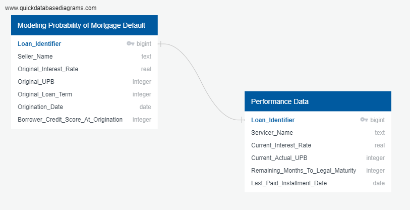
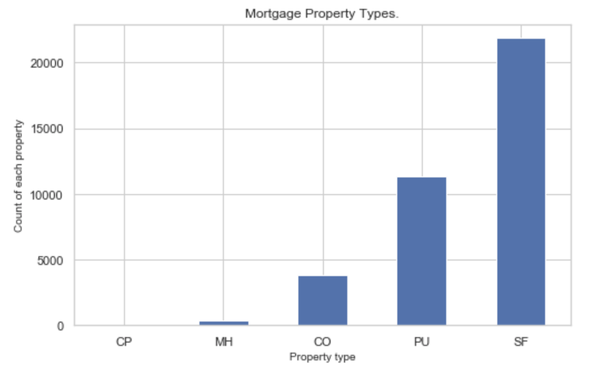
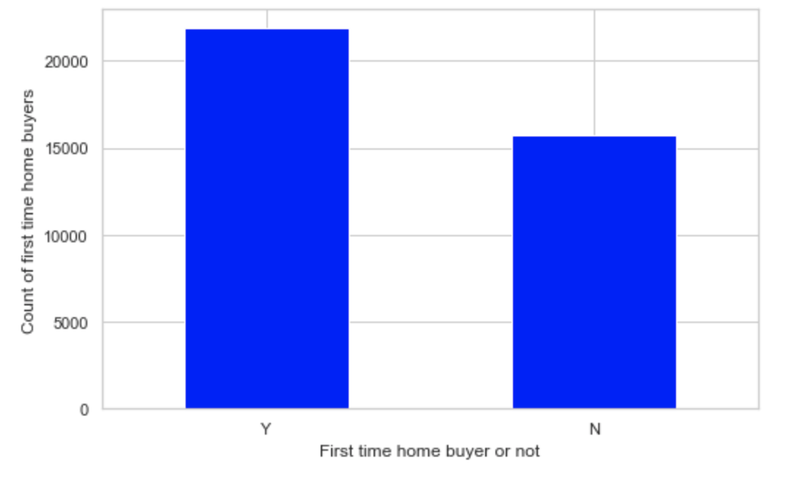
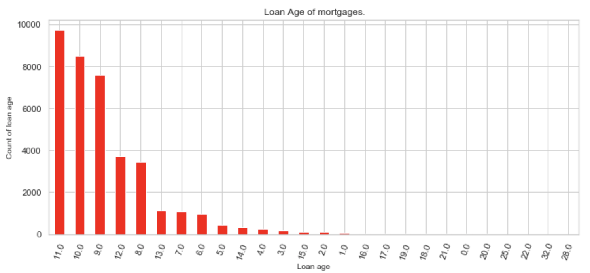
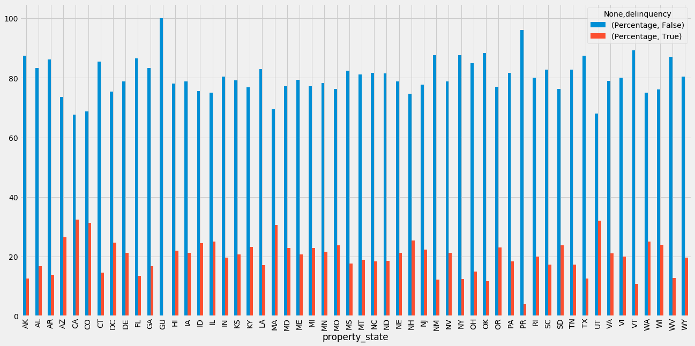
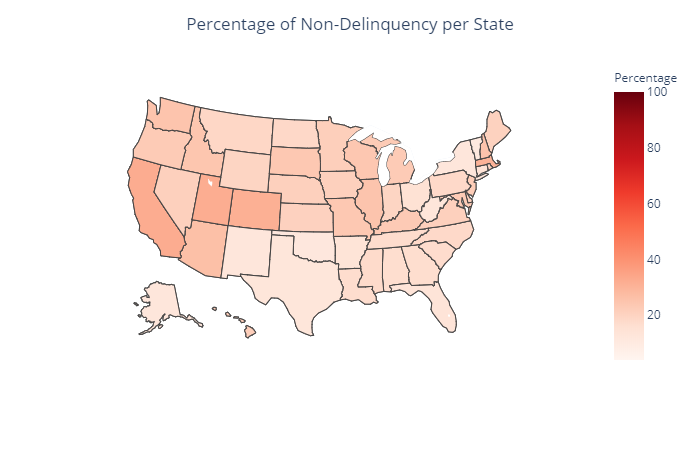
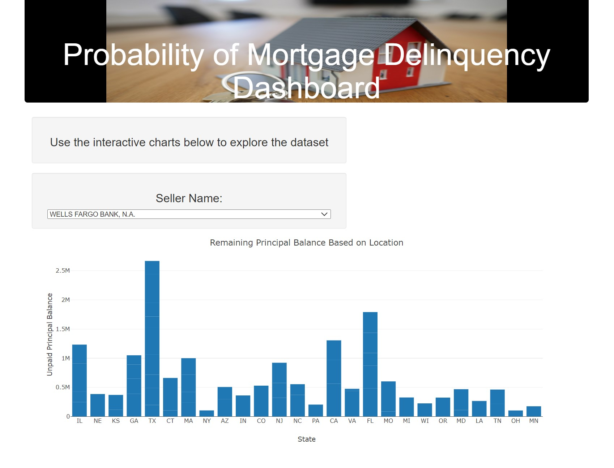

# *Modeling Probablity Of Mortgage Delinquency*

## *Group Name: Team 7*

## *Group Members*

### *Azaima Azghar*

### *Colin Wallace*

### *Kalkidan Alemayehu*

### *Osama Ali*

## *Selected topic*

### *Modeling Probability Of Mortgage Delinquency.*

## *Reason To Select This Topic*

There is a risk in housing market where the applicant of a mortgage application could default on their mortgage payments or the whole loan altogether. Team 7 is going to look into past data of USA mortgage market to see if a common lifestyle or pattern exists to those files which ended up being put in default or bankcrupt status.

 ## *Description Of The Source Of Data*

Fannie Mae provides loan performance data on a portion of its single-family mortgage loans to promote better understanding of the credit performance of Fannie Mae mortgage loans.

Link: https://www.fanniemae.com/portal/funding-the-market/data/loan-performance-data.html

## *Questions The Data hopes To Answer*

#### How often do mortgages go into default status?

----- In the last part of our jupyter file we have just finished evaluating the percentage of delinquncy per state. The country as a whole has a 21.44% True response when ending up in default status. Some states are performing better than others.

#### Is income to loan ratio a major factor to determine risk factor?

----- Our machine Learning Model indicates a 76% accuracy when comparing income to delinquency ratio, which is not insignificant. A little more grooming needs to be done to the model but we belive there might be a strong connection between income and default ratio.

#### Are some states better in maintaining and finishing their term than others?

----- We have started to compare between states. There does seem to be some states which perform better at mitigating the delinquency vs others. we have to determine the root causes for the differences. It could vary from state law, corruption, income, bank policies etc.

## *Resources*

* Data Source: Mortgage Data From Fannie Mae (Acquisition and Performance Data).

* pgAdmin/postgressSQL.
* Google Colabs/Jupyter Notebook.
* Amazon Web Services (AWS).
* Github.
* Python, Javascript, HTML.
* Flask.
* Visual Studio Code.
* Microsoft Excel.
* QuickDBD.
* Draw io.

The acquisition data and the performance data were merged on common feature 'LOAN IDENTIFIER'.

## *What Was Used For Each Section?*

*Postgress*: Database Management, Organizing tables, removing columns which dont provide value.

*Google Co-Labs/ Jupyter Notebook*: Data cleaning and Machine Learning algorith execution will be set up using Python, pandas and Scikit Learn libraries.

*Amazon Web Services (AWS)*: Database, CSV and other data file storage.

*Github*: Creating and maintaining Git repository for submission and project colaboration.

*Visual Studio Code*: Updating the readme files in the branches. 

*Microsoft Excel*: Evaluating our dataset on a high level.

## *Database Integration*

## *QuickDBD*

The ERD of the database shows physical diagrams portraying the physical relationship, or how the data is connected, between each table. The two initial datasets (Modeling Probability of Mortgage Default and Performance Data) portray a one-to-one relationship which means that a row, or entity, is only referenced in one other table. In this case the entity is the Loan_Identifier column.

For our next steps we will be adding more datasets to our database, to create multiple relationships between them.

## *ERD*

## *PgAdmin*

Using pgadmin we will create the relationship schema of the datasets, which are imported as tables. The server on pgadmin will be hosted on AWS. The database will be shared publicly with flask. The flask app will be coded using VS Code.

## *Setting up The Database For The Machine Learning Model*

Colin used his AWS account, and set up a RDS on a Canada (Central) server. The DB, named team7, is postgreSQL, and currently contains five tables. The "acquisition" and "performance" tables are extracted, cleaned, and slightly transformed from the original Fannie Mae dataset. The .ipynb code performing this ETL can be found in "Cleaned_Performance_data.ipynb" and "Cleaning Acquisition Data.ipynb".

The third data table, "merged", is the result of an ETL process in "MergedData.ipynb". This is the table that, as of the week 2 submission, is imported with SQLAlchemy and used as input data when fitting the machine learning model "MachineLearning.ipynb". 

There are two additional tables: "performancemostrecent" and "mergedmostrecent". "performancemostrecent" is a table imported from "full_perf_df.csv", which is created and saved by "MergedData.ipynb". The "mergedmostrecent" table is the result of an SQL left join of "acquisition" and "performancemostrecent". This should provide the same input data as "merged", while saving some server space.

## *Machine Learning Model*

MachineLearning.ipynb, a Python Notebook, is a mockup for the machine learning model segment of our group's pipeline. This file imports the Fannie Mae Acquisition Data. The Data is being acquired into our notebook from PostGresSql which itself is being stored in AWS S3 Storage.

We intially drop all columns with low value to our model and high NAN values to trim our data. Then we moved on to remove all NAN valued rows to keep our model accuracy as high as possible. All columns identified as "object" datatypes are encoded, then merged with the non-object columns of the Acquisition data.

A "Delinquency" boolean is a generated from each loan's Performance data.

The data is split into the target array ("Delinquency"), and the feature matrix. The data is further split into training and testing sets, before being scaled according to the training data. A logistic regression is modelled, but doesn't appear to fit correctly. The deep Forest model provides improved results.

The current model takes 139 variables of input, densely connected to a layer of RelU neurons, followed by another 7 dense layers of Tanh neurons. The final output neuron is a single sigmoid, predicting classification. This structure, and the hyperparameters used while fitting, are likely to change as we transform the input data and try to improve results.

The results of this neural network during and after fitting are expected given the circumstances. The first epoch's accuracy is around 60%, but improves with iteration up to 80% after only 70 epochs. 

## *Analysis*

After connecting with the database, the merged dataset containing the acquisition data and the performance data is placed into a pandas dataframe which is then cleaned. All the null values present the rows are removed. Exploratory analysis is carried out on the cleaned dataset. 

#### *Property Type*

Property type is a field that denotes whether the property type securing the mortgage loan is a cooperative share, condominium, planned urban development, single-family home, or manufactured home.Most mortgages are for Single-Family property type. PUD is the second popular property type and Manufactured-Housing have a small number of mortgages where as Co-Op has the least mortgages approved for.

The number of units comprising the related mortgaged property: There are 37407 mortgages that have one number of unit comprising the property, there are 150 mortgages with two number of units and there are very few 3 or 4 number of units for the related mortgaged property.

#### *Occupancy Type*

Occupancy Type is an indicator that denotes whether the mortgage loan, at its origination date, is secured by a principal residence, second home or investment property.There are 35914 mortgages with secured by a principal residence (P), there are 1423 mortgages with second home (S) occupancy type and there are very few (225) investor (I) occupancy type.

#### *Property State*

Property state is a two-letter abbreviation indicating the state or territory within which the property securing the mortgage loan is located. The most popular property states for the mortgages are CA, TX and FL where the least popular ones are ND and PR.

#### *Delinquency*

 

There are 6747 mortgages that have failed to pay an outstanding debt where as 30815 mortgages are paying on time to the bank.

#### *First Time Home Buyers*

First time home buyer is an indicator that denotes if the borrower or co-borrower qualifies as a first-time homebuyer.There are 21852 first time home buyers mortgages and 15710 mortgages are not for first time home buyers.

#### *Origination Channel*

18165 mortgages have correspondent (C) as their origination channel, 15968 number of mortgages have retail (R) as their origination channel where as only 3429 number mortgages have broker (B) as thier origination channel. Therefore the most popoluar origination channel is correspondent (C) and the least popular origination channel is broker (B) in this mortgage dataset.

#### *The Borrower Credit Score at Origination*

The borrower credit score at origination is a numerical value used by the financial services industry to evaluate the quality of borrower credit. Credit scores are typically based on a proprietary statistical model that is developed for use by credit data repositories. The borrower credit score at origination has a mean of 743, the maximum borrower credit score is 832 and the minimum borrower credit score is 620 in the mortgages dataset. Therefore most of the mortgages have a decent the borrower credit score at origination.

#### *Original Debt To Income Ratio*

Original debt to income ratio is a ratio calculated at origination derived by dividing the borrower’s total monthly obligations (including housing expense) by his or her stable monthly income. This calculation is used to determine the mortgage amount for which a borrower qualifies. The mean of original debt to income ratio is 38.4 with a maximum ratio of 50 and minimum ratio of 1.

#### *Loan Age*

Loan age is the number of calendar months since the mortgage loan origination date. For purposes of calculating this data element, origination means the date on which the first full month of interest begins to accrue.The loan age has mean of 9.88 months and most of the mortgages have loan age of 11 to 9.

#### *Original Combined Loan-to-Value (CLTV)*

Original Combined Loan-to-Value (CLTV) is a ratio calculated at the time of origination for a mortgage loan. The CLTV reflects the loan-to-value ratio inclusive of all loans secured by a mortgaged property on the origination date of the underlying mortgage loan.The. mean of original combined loan-to-value is 94 and most of the mortgages have this ratio.

#### *State Analysis*

State Analysis reflects and measures on all 52 States and Territories of the country to determine if there are some States which perform better than others. The country as a whole has 21.44% Delinquncy Ratio. Please see chart below for a breakdown of all the states

## *Final Dashboard*

The final dashboard represents loan data based on the seller. The dropdown option includes all the banks from our dataset. For the purposes of the dashboard only 500 rows of our dataset were used. To refresh the page, click on the title. 

#### *Files Corresponding To The Dashboard*

1. plots.js file includes the build-up of the charts and variables used in each chart
2. index.html file has the layout of the dashboard 
3. style.css file shows th styling of the dashboard with the background image and text colouring. 

### *Bar Chart*

The first bar chart shows the amount of unpaid principal balance based on the state. By selecting the seller in the dropdown options, we can see which state has a high number of outstanding balances. The higher the unpaid principal balance the higher the application for loans in that particular state. For example: if we select ‘Wells Fargo Bank’ the chart will show TX and FL as the states with the highest unpaid principle. When we conducted our exploratory analysis of our data, the count of property per state were the highest in TX, FL and CA. 

### *Donut Chart*

The second donut chart compares the original interest rate and the current interest rate given by the banks. By looking at the donut chart, we can see that the bank ‘Wells Fargo Bank’ changed their interest rate as time went by. The original interest rate tends to be the same for a large percentage of the loans and in this case, 88.4% of the loans were given a 5% interest rate while 11.6% of the loans had an interest rate of 6%. The current interest rate has changed significantly as only 16.3% of the loans have a rate of 5% and the rest are either lower than the 5% rate or between 5-6% rates. 

### *Bubble Chart*

The third bubble chart shows the loan applicant’s debt to income ratio and their credit score. The colour of the bubbles represents the borrower’s credit score and the size of the bubble represents the debt to income ratio. With this, we can visuals which borrower is most likely to consistently pay their loan and avoid the delinquency status. For example: based on ‘Wells Fargo Bank’ results we can see a cluster of borrowers with a high credit score and a high debt to income ratio. Although, this data is clustered at the high end of both variables, it is important to not that the most ideal borrower would have a lower debt to income ratio with a high credit score. 

### *Dashboard*

Click link to visualize data: https://azaima-asghar.github.io/Modeling-Probability-Of-Delinquency/index.html

## *Google Slides*

### *Link to the google slides:* 
https://docs.google.com/presentation/d/1iNZQTNkwcgDTv_H8VmUclcfFCg5ulul_qshY60kSP0E/edit?usp=sharing 

The first google slide looks like the following:

### *Updating The Google Slides*

The google slides now address the following:

* Project topic and reason it was selected.
* Description of the data and where it was sourced.
* Questions the data intends to answer.
* Description of the data exploration that was conducted.
* Description of the analysis conducted on the data.
* Recount of the different technologies, tools, languages, and algorithms used throughout the project.

