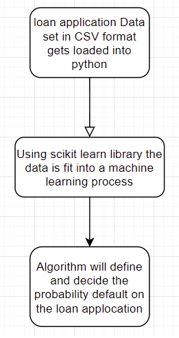
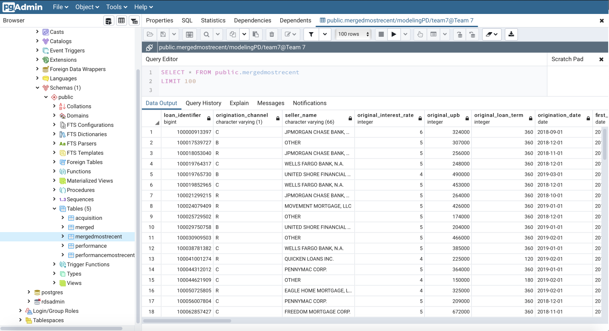

# *Modeling Probablity Of Default*

## *Group Name: Team 7*

## *Group Members*

Azaima Azghar: Square Role; Repository Manager.

Colin Wallace: Triangle role; Machine Learning Architect.

Kalkidan Alemayehu: Circle role; Database Manager.

Osama Ali: X role; Technology Manager.

## *Selected topic*

Modeling probability of  mortgage application
default.

## *Reason To Select This Topic*

There is a risk in housing market where the applicant of a mortgage application could default on their mortgage payments or the whole loan altogether. Team 7 is going to look into past data of USA mortgage market to see if a common lifestyle or pattern exists to those files which ended up being put in default or bankcrupt status.

 ## *Description Of The Source Of Data*

Fannie Mae provides loan performance data on a portion of its single-family mortgage loans to promote better understanding of the credit performance of Fannie Mae mortgage loans.

Link: https://www.fanniemae.com/portal/funding-the-market/data/loan-performance-data.html

## *Questions The Data hopes To Answer*

How often do mortgages go into default status?

Is income to loan ratio a major factor to determine risk factor?

Are some states better in maintaining and finishing their term than others?

## *Resources*

* Data Source: Mortgage Data From Fannie Mae.

    * Acquisition and Performance Data.

* pgAdmin/postgressSQL.
* Google Colabs/Jupyter Notebook.
* Amazon Web Services (AWS).
* Github.
* Visual Studio Code.
* Microsoft Excel.

PLAN: The acquisition data and the performance data are merged on common feature 'LOAN IDENTIFIER'.We want to get more satasets for mortgage and merge them as well down the road to include macro variables such as employment and unemployment.

## *What Will Be Used For Each Section?*

*Postgress*: Database Management, Organizing tables, removing columns which dont provide value.

*Google Co-Labs/ Jupyter Notebook*: Data cleaning and Machine Learning algorith execution will be set up using Python, pandas and Scikit Learn libraries.

*Amazon Web Services (AWS)*: Database, CSV and other data file storage.

*Github*: Creating and maintaining Git repository for submission and project colaboration.

*Visual Studio Code*: Updating the readme files in the branches. 

*Microsoft Excel*: Evaluating our dataset on a high level.

## *How Will The Dashboard Be Built?*

Dashboard will probably be built using python plotly and dash.

## *Description Of The Communication Protocols.*

Team 7 has a shared slack channel that includes all four members of the team: Colin Wallace (Triangle role), Kalkidan Alemayehu (Circle role), Osama Ali (X role) and Azaima Asghar (Square Role). We communicate through this channel and all four of us are very active in this channel, we discuss our progress and our difficulties with others. We also do some meetings every other day or when it is required to meet to discuss the next steps. Everyone is happy to help each other if someone faces some issue. Going forward, we plan to learn plotly dash to create the dashboard for our project, since we will be learning something new we all will be trying to understand it and work together to create the dashboard. 

Starting next week we will clean the present data properly and also look for other datasets that will contain additional macro variables. All in all, with our role duties we all plan to code and help each other get the job done early and leave some additional time to go over our work and try to make it even better.

## *Database Integration*

## *QuickDBD*

The ERD of the database shows physical diagrams portraying the physical relationship, or how the data is connected, between each table. The two initial datasets (Modeling Probability of Mortgage Default and Performance Data) portray a one-to-one relationship which means that a row, or entity, is only referenced in one other table. In this case the entity is the Loan_Identifier column.

For our next steps we will be adding more datasets to our database, to create multiple relationships between them.

## *ERD*

## *PgAdmin*

Using pgadmin we will create the relationship schema of the datasets, which are imported as tables. The server on pgadmin will be hosted on AWS. The database will be shared publicly with flask. The flask app will be coded using VS Code.

## *Machine Learning Model*

MachineLearning.ipynb, a Python Notebook, is a mockup for the machine learning model segment of our group's pipeline. This file imports the Fannie Mae Acquisition Data (currently reads from a local .csv file, but will be updated to import from our server).

Some rough filtering is done (e.g. dropping rows with any NA values). All columns identified as "object" datatypes are encoded, then merged with the non-object columns of the Acquisition data.

A "Foreclosure" boolean is randomly generated for each row. For our final presentation, this will instead be a boolean transformed from each loan's Performance data.

The data is split into the target array ("Foreclosure"), and the feature matrix. The data is further split into training and testing sets, before being scaled according to the training data. A logistic regression is modelled, but doesn't appear to fit correctly. The deep neural network model provides improved results.

The current model takes 139 variables of input, densely connected to a layer of 24 Tanh neurons, followed by another dense layer of 8 Tanh neurons. The final output neuron is a single sigmoid, predicting classification. This structure, and the hyperparameters used while fitting, are likely to change as we transform the input data and try to improve results.

The results of this neural network during and after fitting are expected given the circumstances. The first epoch's accuracy is around 60%, but improves with iteration up to 94% after 100 epochs. This fit sounds promising, until testing using the validation data returns a 61% accuracy. However, this makes sense since the target array is randomly generated. There are no broad patterns to find, so the model "improves" by overfitting the training data.

## StoryBoard

The image below shows our storyboard for our potential dashboard. The dashboard will be interactive by using a filter bar located above the charts.

The zoomed in image shows how the interactive portion of our dashboard would work. Once a seller is picked the bar and bubbles charts will display data pertaining to that specific seller. 

